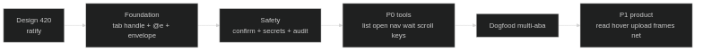
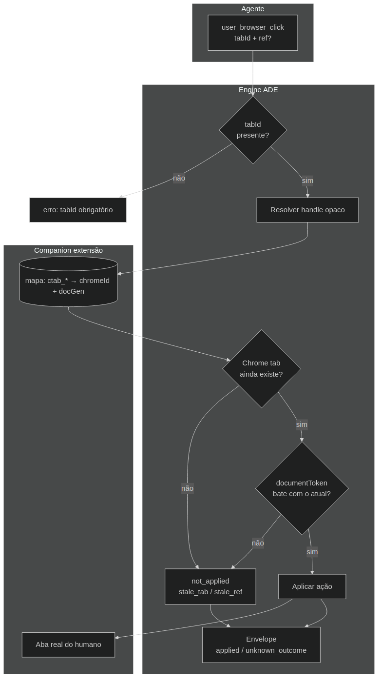
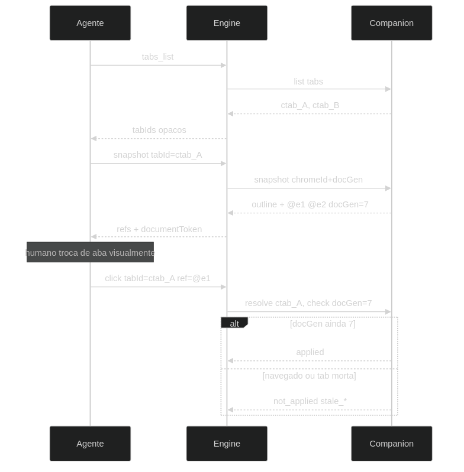
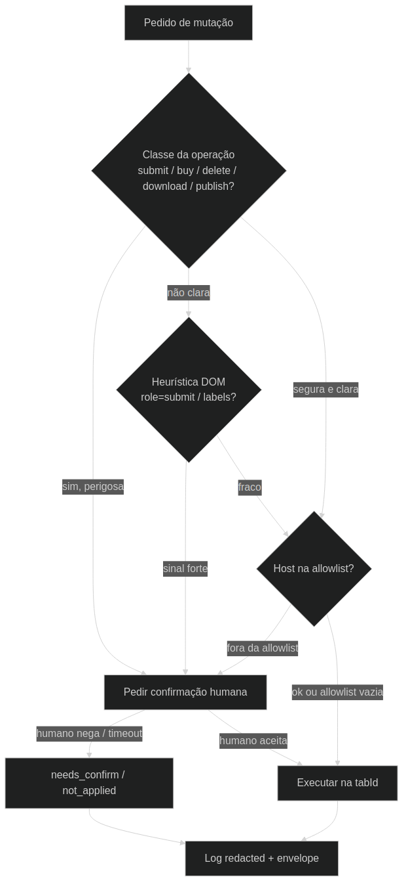

# 420 — cartão de ratificação (visual)

**Status: RATIFIED 2026-07-21** (maintainer: R1–R6 sim).  
Diagramas em `diagrams/`.

## Ordem de entrega



1. **Design** (isto) → 2. **Foundation** → 3. **Safety** → 4. **P0 tools** → 5. **Dogfood multi-aba** → 6. **P1**

---

## R1 — Identidade da aba (substitui “Chrome id na wire”)



| # | Decisão | Em português |
|---|---------|----------------|
| **R1a** | tabId **obrigatório** | Sem default “aba da frente” |
| **R1b** | tabId **opaco** (`ctab_…`) | Chrome id fica **só** na extensão |
| **R1c** | Validar **documento** antes de mutar | Se a página mudou/fechou → `stale_*`, não clica na aba errada |

**Ratify R1?** ☐ sim · ☐ não · ☐ mudar: ___

---

## R2 — Elementos `@e` (mapa da página)



| # | Decisão | Em português |
|---|---------|----------------|
| **R2a** | Snapshot gera `@e1`, `@e2`… | Preferir isso a CSS frágil |
| **R2b** | `@e` vive só naquele documento | Navegar ou re-snapshot invalida |
| **R2c** | Sem fallback silencioso | `@e` morto **não** vira CSS sozinho |

**Ratify R2?** ☐ sim · ☐ não · ☐ mudar: ___

---

## R3 — Confirmação (não só “heurística”)



| Camada | O que faz |
|--------|-----------|
| 1 | Tipo de ação (enviar form, comprar, apagar, baixar, publicar) |
| 2 | Heurística DOM (botão submit, labels) = **sinal extra** |
| 3 | Lista opcional de domínios permitidos |
| 4 | Em dúvida → **pede humano** ou recusa |

**Ratify R3?** ☐ sim · ☐ não · ☐ mudar: ___

---

## R4 — Resposta honesta (envelope)

```
applied          → fez de verdade
not_applied      → recusou / stale / bloqueado
timeout          → tempo esgotado (pode não saber se fez)
unknown_outcome  → não dá para afirmar (não auto-retry)
error            → falha clara
```

Sempre com: `tabId`, URL antes/depois quando souber, `retrySafe`.

**Ratify R4?** ☐ sim · ☐ não · ☐ mudar: ___

---

## R5 — Log de mutações

| # | Decisão |
|---|---------|
| **R5a** | Ficheiro: `.tachyon/companion/mutations.jsonl` |
| **R5b** | **Sem** senhas/valores digitados (só metadados redacted) |
| **R5c** | Rotação + **gitignore** (não poluir o git) |

**Ratify R5?** ☐ sim · ☐ não · ☐ mudar: ___

---

## R6 — Ordem P0 / P1

| # | Decisão |
|---|---------|
| **R6a** | P1 de produto **só depois** do dogfood multi-aba |
| **R6b** | Exceção: pré-requisitos de **safety/identidade** sobem **antes** do dogfood (fazem parte da foundation) |

**Ratify R6?** ☐ sim · ☐ não · ☐ mudar: ___

---

## Resposta rápida (cole no chat)

```
R1 sim
R2 sim
R3 sim
R4 sim
R5 sim
R6 sim
```

Ou mude só o que discordar, ex.: `R1b não — quero Chrome id na wire`.
